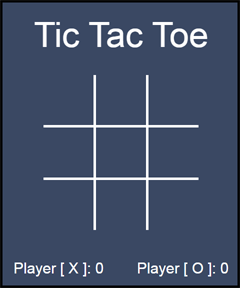

Meu primeiro jogo e também minha primeira aplicação em **JavaScript** depois de ter 
estudado por muitas e muitas horas essa linguagem. Esse é o famoso *Jogo da Velha*, 
onde dois jogadores devem escolher suas marcações ( **X** ou **O** ) para tentar completar uma 
linha horizontal, vertical ou diagonal.

# Imagem de jogo

Este jogo ainda não possui uma **IA**, logo, não é possível joga-lo sozinho. 
Mas talvez eu volte aqui e atualize esse repositório conforme vou aprendendo mais sobre a linguagem JavaScript.
